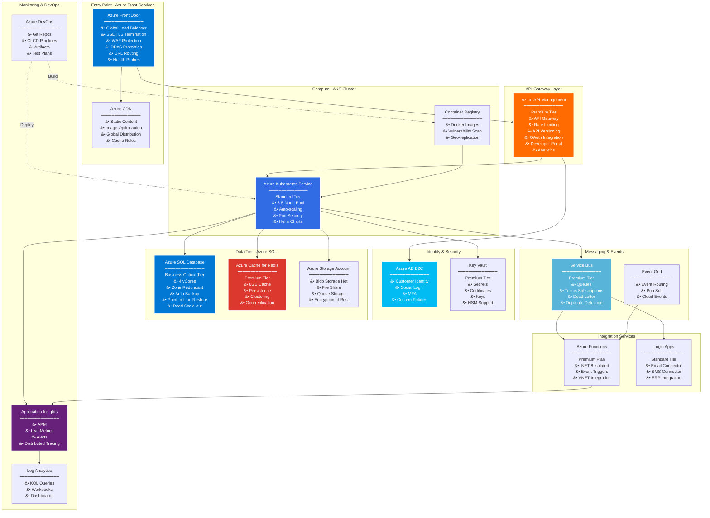

```mermaid
graph TB
    subgraph "Entry Point - Azure Front Services"
        AFD["Azure Front Door<br>━━━━━━━━━━━━━━━<br>&#8226; Global Load Balancer<br>&#8226; SSL/TLS Termination<br>&#8226; WAF Protection<br>&#8226; DDoS Protection<br>&#8226; URL Routing<br>&#8226; Health Probes"]
        
        CDN["Azure CDN<br>━━━━━━━━━━━━━━━<br>&#8226; Static Content<br>&#8226; Image Optimization<br>&#8226; Global Distribution<br>&#8226; Cache Rules"]
    end
    
    subgraph "API Gateway Layer"
        APIM["Azure API Management<br>━━━━━━━━━━━━━━━<br>Premium Tier<br>&#8226; API Gateway<br>&#8226; Rate Limiting<br>&#8226; API Versioning<br>&#8226; OAuth Integration<br>&#8226; Developer Portal<br>&#8226; Analytics"]
    end
    
    subgraph "Identity & Security"
        AAD["Azure AD B2C<br>━━━━━━━━━━━━━━━<br>&#8226; Customer Identity<br>&#8226; Social Login<br>&#8226; MFA<br>&#8226; Custom Policies"]
        
        KV["Key Vault<br>━━━━━━━━━━━━━━━<br>Premium Tier<br>&#8226; Secrets<br>&#8226; Certificates<br>&#8226; Keys<br>&#8226; HSM Support"]
    end
    
    subgraph "Compute - AKS Cluster"
        AKS["Azure Kubernetes Service<br>━━━━━━━━━━━━━━━<br>Standard Tier<br>&#8226; 3-5 Node Pool<br>&#8226; Auto-scaling<br>&#8226; Pod Security<br>&#8226; Helm Charts"]
        
        ACR["Container Registry<br>━━━━━━━━━━━━━━━<br>&#8226; Docker Images<br>&#8226; Vulnerability Scan<br>&#8226; Geo-replication"]
    end
    
    subgraph "Data Tier - Azure SQL"
        SQL["Azure SQL Database<br>━━━━━━━━━━━━━━━<br>Business Critical Tier<br>&#8226; 4 vCores<br>&#8226; Zone Redundant<br>&#8226; Auto Backup<br>&#8226; Point-in-time Restore<br>&#8226; Read Scale-out"]
        
        REDIS["Azure Cache for Redis<br>━━━━━━━━━━━━━━━<br>Premium Tier<br>&#8226; 6GB Cache<br>&#8226; Persistence<br>&#8226; Clustering<br>&#8226; Geo-replication"]
        
        STORAGE["Azure Storage Account<br>━━━━━━━━━━━━━━━<br>&#8226; Blob Storage Hot<br>&#8226; File Share<br>&#8226; Queue Storage<br>&#8226; Encryption at Rest"]
    end
    
    subgraph "Messaging & Events"
        SB["Service Bus<br>━━━━━━━━━━━━━━━<br>Premium Tier<br>&#8226; Queues<br>&#8226; Topics Subscriptions<br>&#8226; Dead Letter<br>&#8226; Duplicate Detection"]
        
        EG["Event Grid<br>━━━━━━━━━━━━━━━<br>&#8226; Event Routing<br>&#8226; Pub Sub<br>&#8226; Cloud Events"]
    end
    
    subgraph "Integration Services"
        FUNC["Azure Functions<br>━━━━━━━━━━━━━━━<br>Premium Plan<br>&#8226; .NET 8 Isolated<br>&#8226; Event Triggers<br>&#8226; VNET Integration"]
        
        LOGIC["Logic Apps<br>━━━━━━━━━━━━━━━<br>Standard Tier<br>&#8226; Email Connector<br>&#8226; SMS Connector<br>&#8226; ERP Integration"]
    end
    
    subgraph "Monitoring & DevOps"
        AI["Application Insights<br>━━━━━━━━━━━━━━━<br>&#8226; APM<br>&#8226; Live Metrics<br>&#8226; Alerts<br>&#8226; Distributed Tracing"]
        
        LA["Log Analytics<br>━━━━━━━━━━━━━━━<br>&#8226; KQL Queries<br>&#8226; Workbooks<br>&#8226; Dashboards"]
        
        ADO["Azure DevOps<br>━━━━━━━━━━━━━━━<br>&#8226; Git Repos<br>&#8226; CI CD Pipelines<br>&#8226; Artifacts<br>&#8226; Test Plans"]
    end
    
    AFD --> APIM
    AFD --> CDN
    APIM --> AAD
    APIM --> AKS
    
    AKS --> KV
    AKS --> SQL
    AKS --> REDIS
    AKS --> STORAGE
    AKS --> SB
    
    ACR --> AKS
    
    SB --> FUNC
    SB --> LOGIC
    EG --> FUNC
    
    AKS --> AI
    FUNC --> AI
    AI --> LA
    
    ADO -.->|Deploy| AKS
    ADO -.->|Build| ACR
    
    style AFD fill:#0078d4,stroke:#fff,stroke-width:2px,color:#fff
    style APIM fill:#ff6b00,stroke:#fff,stroke-width:2px,color:#fff
    style AAD fill:#00bcf2,stroke:#fff,stroke-width:2px,color:#fff
    style AKS fill:#326ce5,stroke:#fff,stroke-width:2px,color:#fff
    style SQL fill:#0078d4,stroke:#fff,stroke-width:2px,color:#fff
    style REDIS fill:#dc382d,stroke:#fff,stroke-width:2px,color:#fff
    style SB fill:#59b4d9,stroke:#fff,stroke-width:2px,color:#fff
    style AI fill:#68217a,stroke:#fff,stroke-width:2px,color:#fff
```
